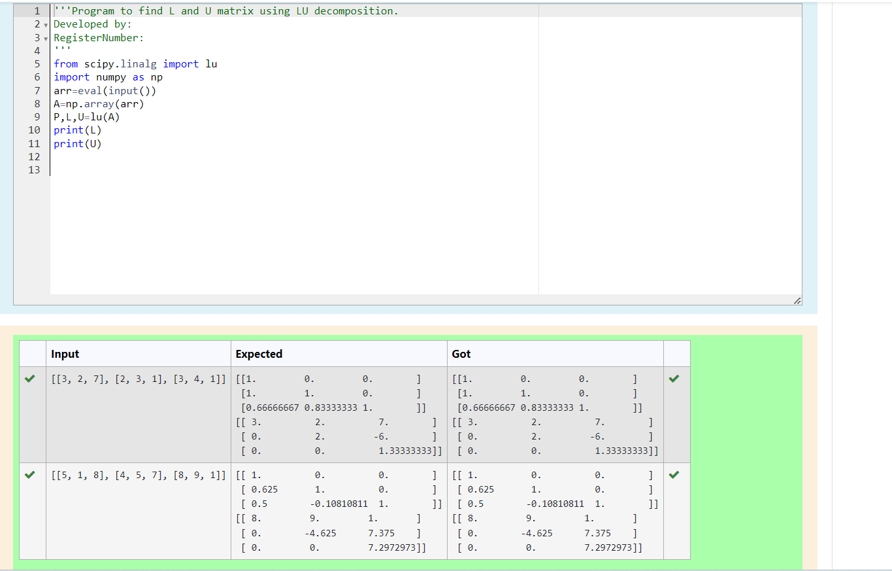
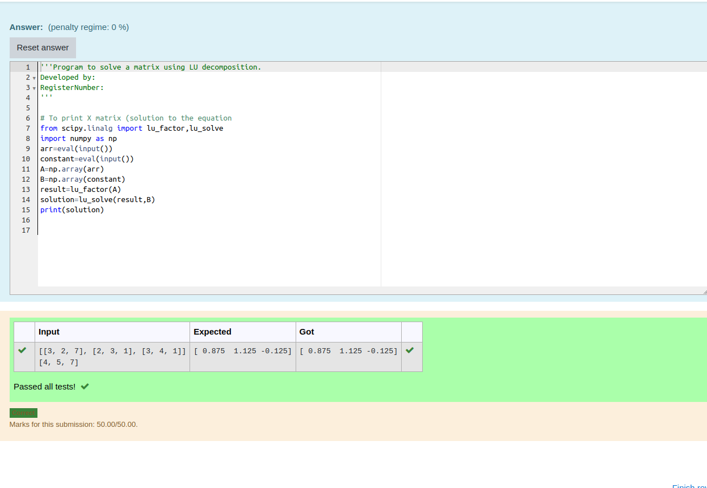

# LU Decomposition 

## AIM:
To write a program to find the LU Decomposition of a matrix.

## Equipments Required:
1. Hardware – PCs
2. Anaconda – Python 3.7 Installation / Moodle-Code Runner

## Algorithm
1. See the value 
2. using the code
3. import the values
4. print the result

## Program:
### Question1:
```py
'''Program to find L and U matrix using LU decomposition.
Developed by: HarishKumar R
RegisterNumber: 23013540'''

from scipy.linalg import lu
import numpy as np
arr=eval(input())
A=np.array(arr)
P,L,U=lu(A)
print(L)
print(U)
```
### Question2:
```py
'''Program to solve a matrix using LU decomposition.
Developed by: HarishKumar R
RegisterNumber: 23013540 
'''

from scipy.linalg import lu_factor,lu_solve
import numpy as np
arr=eval(input())
constant=eval(input())
A=np.array(arr)
B=np.array(constant)
result=lu_factor(A)
solution=lu_solve(result,B)
print(solution)


```
## Output:
question1


question2



## Result:
Thus the program to find the LU Decomposition of a matrix is written and verified using python programming.

